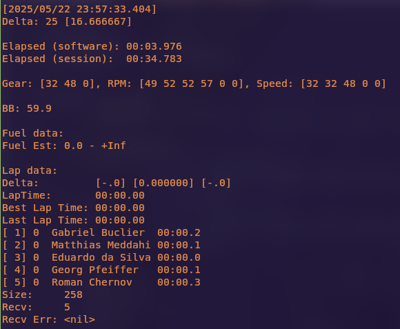

# ESDI
ESDI stands for "ESilva Desktop Interface" iirc, or "rAcElaBs aT hOmE"

This tool collects data from popular racing simulators (for now), to pass it to
peripherals (or a peripheral, only made one so far). This is the currently
available peripheral: [CDashDisplay](https://github.com/ESilva15/CDashDisplay).

If anyone finds this project useful for anything at all it would be pretty cool.
My main goal is to learn and have some fun.

Currently it can read from a `.ibt` file or live telemetry from iRacing.
It can only be ran from the terminal:
`go run . offline -p <port> -i <ibt-file>`

or to view the live data:
`go run . live -p <port>`

Games implemented so far:
- [iRacing](https://www.iracing.com/) using the [goirsdk](https://github.com/ESilva15/goirsdk)

Games being implemented:
- [BeamNG.drive](https://www.beamng.com/game/) using the [gobngsdk](https://github.com/ESilva15/gobngsdk)

Games to be implemented:
- [Assetto Corsa](https://assettocorsa.gg/)

## Roadmap
- [ ] Implement the interface for a data source
- [ ] Finish implementing BeamNG
- [ ] Configuration of the peripherals via ESDI
- [ ] Detection of the display
- [ ] Fuel Calculator
- [ ] LapTime Calculator
- [ ] A very long list useful stuff like flags, position, more info about
other drivers, track conditions and so on so forth
- [ ] Dynamic data packets
- [ ] More roadmap entries
- [ ] Telemetry analysis tool
- [ ] Better user interface
