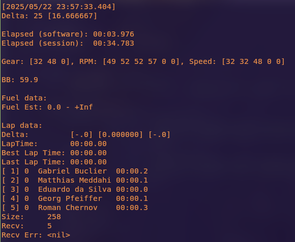

# ESDI
ESDI stands for "ESilva Desktop Interface" iirc, or "rAcElaBs aT hOmE"

This tool collects data from popular racing simulators (for now), to pass it to
peripherals (or a peripheral, only made one so far). This is the currently
available peripheral: [CDashDisplay](https://github.com/ESilva15/CDashDisplay).

If anyone finds this project useful for anything at all it would be pretty cool.
My main goal is to learn and have some fun.

Currently it can read from a `.ibt` file or live telemetry from iRacing.
It can only be ran from the terminal:
`go run . offline -p <port> -i <ibt-file>`

or to view the live data:
`go run . live -p <port>`

Games implemented so far:
- [iRacing](https://www.iracing.com/) using the [goirsdk](https://github.com/ESilva15/goirsdk)

Games being implemented:
- [BeamNG.drive](https://www.beamng.com/game/) using the [gobngsdk](https://github.com/ESilva15/gobngsdk)

Games to be implemented:
- [Assetto Corsa](https://assettocorsa.gg/)

## Roadmap
- [X] Implement the interface for a data source
- [ ] Finish implementing BeamNG
- [ ] Configuration of the peripherals via ESDI
- [ ] Detection of the display
- [X] Fuel Calculator
- [ ] LapTime Calculator
- [ ] A very long list useful stuff like flags, position, more info about
other drivers, track conditions and so on so forth
- [X] Dynamic data packets
- [ ] More roadmap entries
- [ ] Telemetry analysis tool
- [ ] Better user interface

## Todos
- [X] Make the program report what its doing as the window title `\x1b]0;TITLE\x07`
  Quicker than I thought. Just have to maintain it
- [ ] Add a way to check the unit of a given variable
Expand on this concept by creating conversions for those units
- [ ] Remove all the `slog.logger` passing and struct members and just configure
`slog.Logger` once and use the default. Or think of something better
- [ ] Do all the `NOTE`s and `BUG`s
- [ ] Whats common among the providers? Should abstract whats common
- [ ] Whats common with all the "streams" I have? Should abstract whats common

### BUGS
- [ ] Fuel calculator hard coded max laps of 256 value results in out of range for
**gasp** sessions longer than 256 laps... Use the file `max_laps_error.txt` as
reference

## Development
### Mockservers
To mock [BeamNG.drive](https://www.beamng.com/game/), I built 
[BeaMNGMockOg](https://github.com/ESilva15/BeamNGMockOg) (should have though longer
about the name).
You create a recording by launching the BeamNG and then launching the mockserver with:
`BeamNGMockOg record -a 127.0.0.1 -p 4443 -o output.bin`.

To replay the recording: 
`BeamNGMockOg replay [--loop] -a 127.0.0.1 -p 4443 -i input.bin`

### Troubleshooting
#### Can't see BeamNG data coming through
Use, for example, `tcpdump -i any udp port <port> -X` to check if any data is available.

### Debugging
#### Freezes:
Using delve:
- Launch Terminal1 with `dlv debug . --headless --listen=:2345 -- tui`
- Launch Terminal2 and connect to with with `dlv connect :2345`
- Type `continue` onto Terminal2 and go to Terminal1 to use the application
normally until it hangs.
- Go back to Terminal2 to and do a `Ctrl+c` to capture the state and then check
what went wrong by looking at the `goroutines` for example.

pprof:
- `go tool pprof http://localhost:8001/debug/pprof/mutex`
  - type `top` to view the summary
  - type `web` to view a graph version

## Shameless begging
Hey, doesn't hurt to try, its free either way:
[Buy me a coffee!](buymeacoffee.com/ESilva_15)

